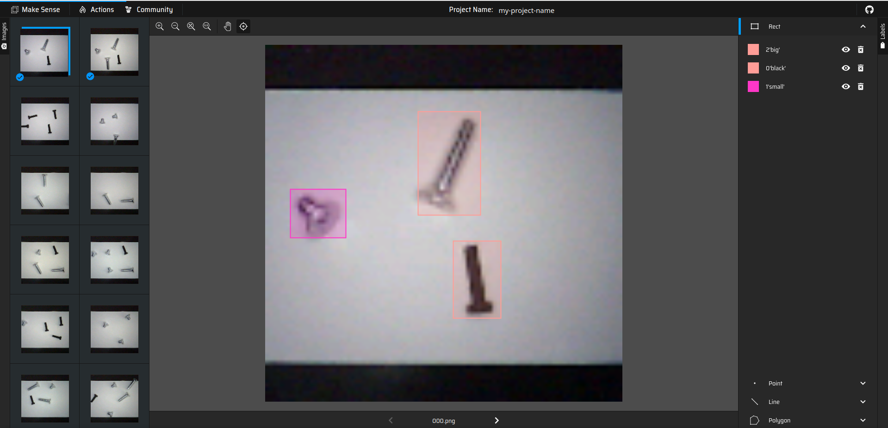

# Screw Type Detection Using ESP-EYE and TensorFlow Lite Micro

This project focuses on using the ESP-EYE and a computer vision algorithm running TensorFlow Lite Micro to detect different types of screws: "Big," "Medium," and "Black." The project consists of two main parts:

1. Data Collection and Model Training
2. Model Deployment on ESP32

## 1. Setup the Development Environment
### Install the ESP-IDF

Follow the [ESP-IDF Get Started Guide](https://docs.espressif.com/projects/esp-idf/en/latest/esp32/get-started/linux-macos-setup.html) to set up the toolchain and install the ESP-IDF framework.

## 2. Data Collection 
Navigate to the `data_collector` folder.

### Flashing the ESP32

1. Navigate to the `esp32` directory, activate the ESP32 virtual environment, and clean the build directory:

```bash
cd esp32/
get_idf
idf.py fullclean
```

2. Set up your Wi-Fi credentials by running:

```bash
idf.py menuconfig
```

Navigate to **Example Connection Configuration** and input your Wi-Fi SSID and password.

3. Build and flash the application to the ESP32:

```bash
idf.py build
idf.py -p /dev/ttyUSB0 flash
idf.py -p /dev/ttyUSB0 monitor
```

After flashing, the ESP32’s IP address will be displayed. This IP address will be used to access the web server.

```bash
I (4180) WIFI_MODULE: got ip:X.X.X.X
I (4184) WIFI_MODULE: connected to ap <CONFIGURED_SSID> password:<CONFIGURED_PASSWORD>
```

### Running the Web Server

The web server receives images from the ESP32 and stores them in the uploads folder. To start the web server:

1. Set the ESP32’s IP address as an environment variable:

```bash
export ESP32_SERVER_URL=http://<ESP32_IP>:81
```

2. Start the web server:

```bash
cd webserver/
python3 webserver.py
```

3. In a new terminal, start capturing images:

```bash
python3 capture.py
```

Captured images will be saved in the `static/uploads` directory.

### Labeling the Data

1. Use [makesense.ai](https://www.makesense.ai/) for labeling the collected images.
2. Upload the images from the `webserver/static/uploads/` directory to the platform.
3. Load the labels from `labels.txt` and begin labeling your images.
The labels should be "Big," "Medium," and "Black." and the images should be labeled accordingly. The interface should look like this:



4. After labeling, export the annotations in YOLO format. The files should follow the format `XXX.txt`, where XXX corresponds to the image number.

If you are not familiar with the YOLO format, here is an example of the format for a file named `000.txt`:

```bash
0 0.509715 0.331606 0.190415 0.272021
1 0.591321 0.654793 0.107513 0.224093
```

The first number is the **label**, and the next four numbers are the bounding box coordinates in the format `x_center y_center width height`, scaled to the image size. 

For example, if the image size is 640x480, the bounding box 

```bash
0.509715 0.331606 0.190415 0.272021
```

 would be 
```bash
x_center=0.509715*640=326.29 
y_center=0.331606*480=159.14 
width=0.190415*640=121.86 
height=0.272021*480=130.57
```

### Dataset Preparation

To split the labeled dataset into training and testing sets:

1. Move the labeled images and annotation files into the appropriate directories:

```bash
cd datasets/
rm -rf images labels
mkdir images labels
mv <path_to_labels_zip_file> labels/
cp ../webserver/static/uploads/* images/
```

2. Split the dataset:

```bash
python3 split_dataset.py
```

You should now have inside `images/` and `labels/` the dataset split into `train`, `val`, and `test` directories.

## 3. Model Training
### Training the YOLOv5 Model
For the model training the [YOLOv5](https://github.com/ultralytics/yolov5) repository from [ultralytics](https://ultralytics.com) will be used. The following steps will guide you through the model training process:

1. Navigate to the YOLOv5 Directory:

```bash
cd yolov5/
```

2. Train the Model:

Run the following command to start training:

```bash
python train.py --img 96 --cfg ../data_collector/model.yaml --batch 32 --epochs 300 --data ../data_collector/model_data.yaml --name my_run
```

This command trains the model with the specified image size, configuration file, batch size, number of epochs, and data configuration. The trained model will be saved in the `runs/train/my_run/weights` directory by default.

**Note:** Model training may take a significant amount of time depending on your hardware.

3. Testing the Model:

After training, you can test the model on the test dataset with the following command:

```bash
python detect.py --source ../data_collector/datasets/images/test/ --weights runs/train/my_run/weights/best.pt --img 96 --name my_run --data ../data_collector/model_data.yaml
```

This command runs detection on images from the test dataset and saves the results in the `runs/detect/my_run` directory.

### Model Quantization and Conversion using YOLOv5

1. Convert and Quantize the Model:

Export the trained model to TensorFlow Lite (TFLite) format and apply quantization with the following command:

```bash
python export.py --weights runs/train/my_run/weights/best.pt --include saved_model tflite --img 96 --data ../data_collector/model_data.yaml
```

The quantized model will be saved in the `runs/train/my_run/weights` directory.

**Note:** The output directory will vary each time you retrain the model, so ensure that you update the path as needed.

### Model Quantization and Conversion using my own script

Convert the Model to a C Array:

Navigate to the `data_collector/datasets/` directory and run:

```bash
python convert_model_to_tflite.py ../../yolov5/runs/train/my_run/weights/best_saved_model/ images/test/<image_name>.jpg
```

This command converts the TFLite model to a C array format, generating a `model.cc` file. You can use this file to deploy the model on the ESP32, while the `.tflite` file can be used for testing the model on your computer.

**Note:** this script generates a different `.tflite` as `export.py`. I don't use the exported from `export.py` because it's a bit larger than the one generated by `convert_model_to_tflite.py`, but I didn't test if it works with the ESP32.

## 4. Model Deployment on ESP32

After training and converting your model, you’ll need to deploy it to the ESP32. Follow these steps to integrate the model and flash it onto the ESP32:

### Integrate the Model into the ESP32 Codebase

1. Copy the Model File:

Copy the `model.cc` file generated from the previous steps to the `application/main` directory of your ESP32 project.

2. Update Label Settings:

If your labels differ from the default labels, update the `model_settings.cc` file in the `application/main` directory to reflect the new labels.

### Build and Flash the Application

1. Navigate to the Application Directory:

```bash
cd application/
```

2. Set Up the ESP-IDF Environment:

```bash
get_idf
```

3. Clean, Build, and Flash the Application:

```bash
idf.py fullclean
idf.py build
idf.py -p /dev/ttyUSB0 flash
idf.py -p /dev/ttyUSB0 monitor
```
These commands will clean any previous build artifacts, build the application, flash it to the ESP32, and open the serial monitor to view the ESP32's output.

## TODOs
- Send Results to BLE Client: Implement functionality to send the detected screw type results to a BLE client.
